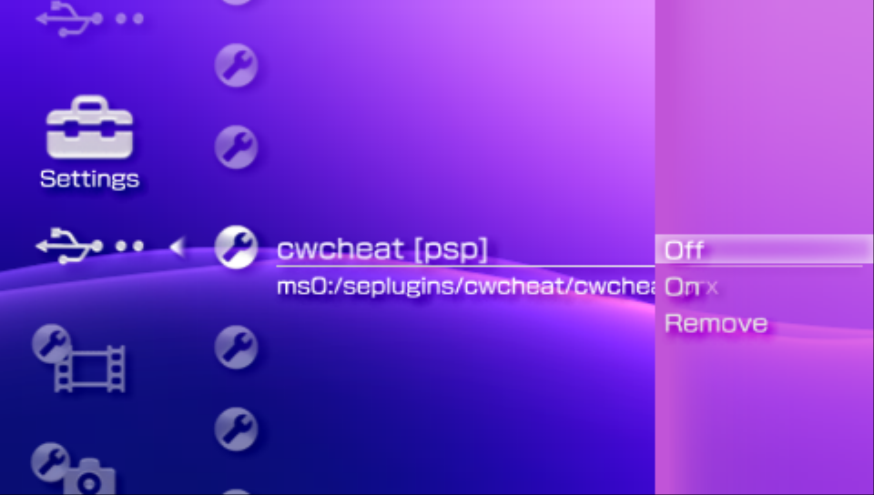

# PSP Plugin
---

## Adding a plugin

1. Put the `.prx` file somewhere on `???0:/pspemu/seplugins/` directory (create if it doesn't exist)
2. Open the `???0:/pspemu/seplugins/EPIplugins.txt` (create if it doesn't exist)
3. Add to the configuration line in the general format: `⟨RUNLEVELS⟩, ⟨PLUGIN PATH⟩, ⟨on/off⟩`

	- You can find more information on the format [here](./02-PluginConfigFormat.md)

> [!IMPORTANT]
> Before version 8.0.0, Adrenaline used another format and files for the plugins
>
> If you just updated from previous version, Adrenaline provides an easy way to import the old style to the new:
>
> 1. Open Recovery Menu
> 2. Go to the `Advanced` section
> 3. Select and click on `Import classic plugins`
>
> 
  

## Managing Plugins

Adrenaline offers two ways to manage plugins already added.

### First method: XMB Settings

1. On XMB, go to the `Settings`
2. Find the `★ Plugins Manager` and the confirmation button, a list of added plugins will show up
3. Select the plugin, click the confirmation button.
4. Select the the state (`on`/`off`/`remove`), confirm with the confirmation button.

	- The `remove` option will remove the line of the configuration file and restart the system
5. Return back to save configuration.

 

<!--   -->

> [!WARNING]
> Modification of the plugin state on any plugin that has XMB/VSH runlevel (`xmb`/`vsh`) needs to restart the XMB/VSH to take effect.

### Second method: Recovery Menu

<!-- TODO: LINK TO RECOVERY MENU -->
1. Open Recovery Menu
2. Go to the `Plugins` section
3. Go over your plugins and use `←`/`→` to select the plugin state
4. Go back to the `General` section
5. Exit the Recovery Menu

 

